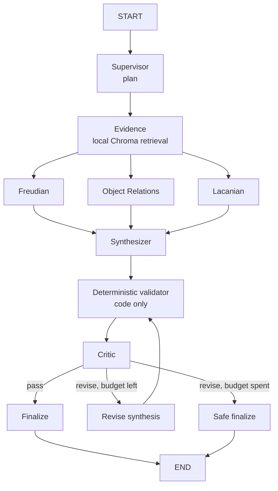

# PsycheGraph

**Multi-agent psychoanalytic theory explorer** — a local-first exploration of a
three-school psychoanalytic reading pipeline (Freudian / Object Relations /
Lacanian) built on LangGraph, with a web UI that shows the agent graph working.

**理论沙盒 · 解读文本、拆解叙事，三路视角同时开工。**

---

## What it is

PsycheGraph turns one piece of material (a dream, a narrative, a literary text,
a relationship fragment) into a multi-perspective theoretical reading:

- a **Supervisor** plans the turn and decides whether the user asked for a
  clinical judgement;
- an **Evidence** node retrieves passages from a **local** Chroma index
  (BGE-M3 embeddings, no cloud service, built offline);
- three **specialists run concurrently** — Freudian, Object Relations, Lacanian —
  each with its own prompt, its own shelf of material and structured output;
- a **Synthesizer** merges the three readings and cites the retrieved passages;
- a **deterministic validator** (pure code) and a **Critic** (model) review the
  draft for observation fidelity, evidence support, theory consistency and
  clinical safety;
- at most **one revision** is allowed; if the draft still fails, a conservative
  **safe fallback** is published instead of unsupported text.

The web layer is a custom FastHTML app served next to the agent API: it streams
the *workflow* (node states) while the run happens, then shows the finished
answer with clickable citations and the evidence panel behind it.

## Architecture



Normal turn: **6 model calls** (Supervisor, 3 specialists, Synthesizer, Critic).
One revision: **8 calls**. The evidence node, the validator and both finalizers
never call a model.

```mermaid
flowchart LR
    browser[Browser] -- "POST send-message" --> web[FastHTML app]
    web -- "queue message" --> reg[(in-process registry)]
    browser -- "GET …/stream (SSE)" --> web
    web -- "runs.stream(tasks, updates)" --> api[LangGraph API]
    api --> graph[Agent graph]
    graph -- "task / update events" --> web
    web -- "sanitized workflow / answer / sources / error / close" --> browser
```

## Technology stack

| Layer | Choice |
|---|---|
| Orchestration | LangGraph 1.x `StateGraph`, `langgraph dev` server |
| Models | DeepSeek (`langchain-deepseek`), structured output via function calling |
| Retrieval | `langchain-chroma` + `sentence-transformers` (BAAI/bge-m3, CPU) |
| Web | FastHTML (server-rendered), HTMX 2 + `htmx-ext-sse`, one small JS file |
| Tooling | `uv`, `ruff`, `mypy --strict`, `pytest` |

## Quick start

**Windows one-click (demo container, no licence needed):** double-click
`demo_up.cmd` in the repository root - it starts Docker Desktop when needed,
brings the stack up, waits for `/health`, prewarms the embedding model and
opens the browser. Stop it with `demo_down.cmd` (the 4.5 GB weights volume and
the RAG index are kept, so a restart takes seconds). The manual steps below
are still the reference for a first-time setup or a Linux host.

```bash
pip install uv
uv sync

# 1. configure the model provider (see .env.example)
#    DEEPSEEK_API_KEY=sk-...
#    DEEPSEEK_MODEL=deepseek-flash

# 2. (optional, RAG) put your own material into knowledge/<school>/ and index it
uv run python scripts/index_knowledge.py --rebuild

# 3. run the app + API on one port
uv run langgraph dev --no-reload
```

Then open <http://127.0.0.1:2024>.

Retrieval runs off the event loop (`asyncio.to_thread`), so the dev server no
longer needs `--allow-blocking`. Without an index the graph still runs - every
reading then states that it has no local literature behind it instead of
inventing sources.

## The web UI

Three areas, one page:

- **left** – conversations (titles come from the first user message; no extra
  model call);
- **middle** – chat: your message, then the final answer with theory tags, a
  quality line and clickable citation labels;
- **right** – *Agent Workflow* (every node with a text status, a short message
  and its real duration) and *Theory Evidence* (retrieved passages grouped by
  school, with metadata read from the index only).

The run streams over SSE as named events (`workflow`, `sources`, `answer`,
`error`, `close`). There is **no fake token streaming**: with structured output
the visible answer only exists after the finalizer runs, so the UI shows
progress instead of pretending to type. During a run the composer is disabled;
when the stream closes it is restored. A failed run shows one short sentence and
never a traceback.

**System / Evaluation** (`/evaluation`) renders the Phase 8 ablation results
from `docs/evaluation_summary.json`, a small aggregate-only artifact produced by
`scripts/export_evaluation_summary.py`. The page never calls a model and never
re-runs the evaluation.

## Evaluation results (Phase 8, 60 cases × 4 variants)

| Variant | LLM calls | Latency | Tokens | Theory differentiation | Citation validity | Clinical boundary |
|---|---|---|---|---|---|---|
| Single Agent | 1.00 | 12.3 s | 3,244 | 3.92 | N/A | 5.00 |
| Multi Agent | 5.03 | 57.5 s | 19,753 | 4.27 | N/A | 5.00 |
| Multi Agent + RAG | 5.10 | 57.5 s | 23,138 | 4.45 | 1.00 | 4.92 |
| Full System (Critic) | 6.23 | 67.0 s | 33,692 | 4.42 | 1.00 | 4.92 |

N/A means the metric does not apply to that variant; it is never counted as 0.
The clinical refusal rate is 1.00 for all four variants. RAG metrics come from a
project-authored **test corpus** (`TEST FIXTURE`); full tables, method and
caveats are in `docs/EVALUATION.md`.

These numbers describe **engineering behaviour** — grounding, citation
integrity, theory differentiation, safety boundaries, latency — not the validity
of psychoanalytic theory or of any clinical treatment.

## Agent workflow

| Phase | Node | Model call |
|---|---|---|
| Plan | `supervisor` | yes |
| Evidence | `evidence` | no (local index) |
| Theory (parallel) | `freudian`, `object_relations`, `lacanian` | 3 |
| Synthesis | `synthesizer` | yes |
| Review | `deterministic_validator` (code), `critic` | 1 |
| Publish | `finalize` or `safe_finalize` | no |

Layer-by-layer documentation:

- `docs/使用说明.md` – how to run and demo it, and what to say (and not say)
- `docs/技术说明.md` – the whole system on one page (graph, contracts, RAG, web, ops)
- `docs/ARCHITECTURE.md` – project-wide architecture and change plan
- `docs/MODEL_PROVIDER.md` – DeepSeek provider layer
- `docs/STRUCTURED_OUTPUT.md` – schemas and state contract
- `docs/MULTI_AGENT_ARCHITECTURE.md` – supervisor, specialists, synthesis
- `docs/RAG_ARCHITECTURE.md` – local knowledge base and evidence contract
- `docs/CRITIC_ARCHITECTURE.md` – validator, critic, bounded revision
- `docs/EVALUATION.md` – evaluation framework and ablation study
- `docs/WEB_ARCHITECTURE.md` – SSE contract, workflow UI, evidence, citations
- `docs/SECURITY_DEPLOYMENT.md` – exposure, ownership, limits, Docker artifacts
- `docs/PRODUCTION_DEPLOYMENT.md` – the single-VPS runbook (Docker, Caddy, HTTPS)
- `docs/DEPLOYMENT_BENCHMARK.md` – memory/latency measurements and sizing
- `docs/DEPLOYMENT_OPTIONS.md` – managed platform vs own VPS
- `deploy/Caddyfile.example` – reverse proxy with the public route allowlist

## Screenshots

_Placeholder — to be added in a later phase:_

- desktop: chat with the workflow and evidence panels next to it;
- narrow window: the workflow/evidence drawer and the collapsed sidebar;
- `/evaluation`: the four-variant comparison table with its disclaimer.

## Limitations

- Retrieval is intentionally local and small; the shipped demo index is a
  **project-authored test corpus**, not a Freud / Klein / Lacan source library.
- The first retrieval in a fresh process costs ~12 s (BGE-M3 loads lazily) and
  peaks at ~2 GB RSS; `scripts/prewarm_rag.py` moves that cost off the first
  request. Numbers and method: `docs/DEPLOYMENT_BENCHMARK.md`.
- The workflow panel mirrors the **current** run. After a reload the
  conversation, the newest answer and its citations come back from the
  checkpoint, but the step log does not.
- One run per browser session at a time, enforced server-side (429 notice);
  there is no cancel button yet.
- A failed run can be resent by hand; automatic replay is deliberately not
  implemented, because a retry must not duplicate a turn in the checkpoint.
- Authentication is a shared bearer token plus a per-browser session cookie, not
  a user account system. Read `docs/SECURITY_DEPLOYMENT.md` before exposing the
  port to anyone else.

## Container run (two options)

The container artifacts come from the official LangGraph CLI and are checked in;
regenerating and verifying them needs no Docker:

```bash
uv run python scripts/prepare_docker.py          # Dockerfile + compose + lock
uv run python scripts/prepare_docker.py --check  # used by the test/CI gate
uv run python scripts/prewarm_rag.py             # load BGE-M3 once
uv run python scripts/bench_rss.py --skip-run    # memory / latency ladder
```

**Option A - the official runtime** (needs a LangGraph Platform licence or a
LangSmith API key with LangGraph Cloud access; the image refuses to start
without one, see `docs/PRODUCTION_DEPLOYMENT.md` step 6):

```bash
docker build -f docker/Dockerfile -t psychegraph:local .   # measured: 2.92 GB, 5.4 min
docker compose -f docker/docker-compose.yml --env-file .env up -d
curl http://localhost:8123/health
```

**Option B - demo-grade, no licence** (the free runtime `langgraph dev` uses):

```bash
docker build -f docker/Dockerfile.dev -t psychegraph:dev .  # measured: 2.36 GB, 3.5 min
docker compose -f deploy/docker-compose.dev.yml --env-file .env up -d
curl http://localhost:8123/health
```

On Windows this is the same thing as double-clicking `demo_up.cmd`
(`demo_up.cmd -SkipPrewarm -NoBrowser` for scripted runs, `demo_down.cmd` to stop).

Option B keeps everything that matters for the demo - same app, auth, limits,
RAG, web UI, SSE - but **threads and checkpoints live in process memory**, so
they disappear on restart, and PostgreSQL/Redis are not used. It is a
development server and must be described as a demo, not as production.

Both options publish the API on `127.0.0.1` only; a reverse proxy
(`deploy/Caddyfile.example`) is the single process that may face the internet.
The exposure table, limits and the remaining gaps are in
`docs/SECURITY_DEPLOYMENT.md`; the full VPS runbook - including what was and was
not verified, and the host/proxy problems a Windows workstation adds - is
`docs/PRODUCTION_DEPLOYMENT.md`.

## Development

```bash
uv sync
uv run python -m compileall src scripts
uv run ruff check src scripts tests
uv run ruff format --check src scripts tests
uv run mypy src/react_agent --strict
uv run pytest tests/unit_tests -q
```

Verification scripts (real model calls, they read `.env`):

```bash
uv run --env-file .env python scripts/verify_single_agent.py
uv run --env-file .env python scripts/verify_structured_output.py
uv run --env-file .env python scripts/verify_multi_agent.py
uv run --env-file .env python scripts/verify_rag.py
uv run --env-file .env python scripts/verify_critic.py
uv run python scripts/inspect_stream.py --url http://127.0.0.1:2024
```
