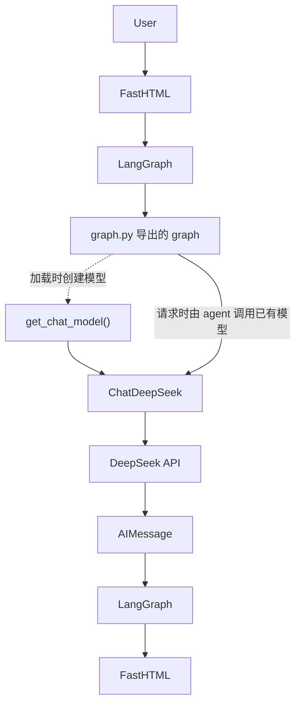

# Phase 2：DeepSeek 模型 Provider 层

## 1. 范围与选择

当前业务模型使用 `langchain-deepseek` 的 `ChatDeepSeek`，默认模型为 `deepseek-flash`。该类实现 LangChain 聊天模型接口，可以直接作为模型对象传给现有 `create_react_agent`，同时保留消息对象、异步调用和流式接口。

本阶段只替换模型 Provider，并将初始化逻辑独立出来。Graph 仍由预构建工厂生成，实际拓扑仍为 `START → agent → END`；`tools=[]`、原系统 Prompt、默认 State、FastHTML 和 auth 业务代码均保持原样。

`ARCHITECTURE.md` 是 Phase 1 的历史分析，其中 Anthropic 模型入口描述对应改造前状态。当前模型配置以本文和 `src/react_agent/models.py` 为准。

## 2. 配置与密钥

| 环境变量 | 作用 |
|---|---|
| `DEEPSEEK_API_KEY` | DeepSeek API 请求凭据。由 `ChatDeepSeek` 自行从进程环境读取并包装为秘密类型；业务代码不硬编码、不打印其值。 |
| `DEEPSEEK_MODEL` | 选择模型。未设置时，`get_chat_model()` 默认使用 `deepseek-flash`；若显式设置，按该环境值初始化。 |

`.env.example` 提供空密钥配置项和 `DEEPSEEK_MODEL=deepseek-flash`。实际密钥由使用者在本地配置，不能复制到源码、测试输出或本文。现有 Anthropic/OpenAI/Fireworks 示例仍保留，但当前业务 Graph 不初始化这些 Provider。

LangGraph 启动时通过 `langgraph.json` 的 `env: ".env"` 加载环境。`models.py` 不自行读取 `.env`；独立 Python 调用需要先设置进程环境，或通过 uv 的 `--env-file .env` 正常加载。没有有效配置时，`ChatDeepSeek` 会在初始化阶段报错，应人工填写配置，不使用假密钥。

`.gitignore` 仍包含独立的 `.env` 规则。本次没有修改实际 `.env`。

## 3. models.py 的职责与实际 API

`src/react_agent/models.py::get_chat_model()` 统一创建模型对象：

```python
def get_chat_model() -> ChatDeepSeek:
    return ChatDeepSeek(
        model=os.environ.get("DEEPSEEK_MODEL", "deepseek-flash"),
        timeout=60.0,
        max_retries=2,
        extra_body={"thinking": {"type": "disabled"}},
    )
```

超时设为 60 秒，客户端最多重试 2 次；重试后的总耗时可能超过单次超时。未设置 temperature、工具绑定或结构化输出。

本次通过 `uv add langchain-deepseek` 安装版本 `1.1.0`，由 uv 自动更新 `pyproject.toml` 和 `uv.lock`，没有手写锁文件。其余 Provider 依赖未删除。静态检查使用项目已经声明的 `dev` extra 中的 Ruff 和 mypy。

实现前核对了本地安装的真实 API：

- `.venv/Lib/site-packages/langchain_deepseek/chat_models.py::ChatDeepSeek`：`model_name` 的别名是 `model`；`api_key` 使用 `secret_from_env` 读取 DeepSeek 凭据；`validate_environment` 将 timeout/max_retries 传入底层客户端。
- `.venv/Lib/site-packages/langchain_openai/chat_models/base.py::BaseChatOpenAI`：提供 `request_timeout`（别名 `timeout`）、`max_retries`、`extra_body`；temperature 默认 `None`。
- 此版本默认 API 地址为 `https://api.deepseek.com/v1`，也支持其自身的 `DEEPSEEK_API_BASE` 环境覆盖。本项目没有新增地址配置或代理层。

安装包中的部分示例仍使用旧模型名称，业务默认值明确采用本阶段指定的 `deepseek-flash`。

## 4. graph.py 的依赖关系

`src/react_agent/graph.py` 导入 `get_chat_model`，在模块加载时执行 `model = get_chat_model()`，再将 model 对象传给 `create_react_agent`。

```text
graph.py → models.py → langchain_deepseek.ChatDeepSeek
```

`models.py` 不导入 Graph 或网页组件。模型初始化在 Graph 加载时发生；每条消息执行时，已有 `agent` 节点调用该模型对象。调用工厂本身不会发送模型请求，`ainvoke` 等执行方法才触发外部请求。

现有包 `react_agent/__init__.py` 会导入 `graph`，因此通过包导入模型模块也会触发 Graph 初始化；本阶段保留该行为。

## 5. 数据流

以下图示保留用户视角的数据流，并标明初始化与请求执行的区别：



FastHTML 仍使用 SDK 创建 run 和订阅事件；模型返回 `AIMessage` 后由原 Graph 合并进消息 State，再通过原有 SSE 路径显示。新增模型工厂不改变 HTTP 路由或网页消息处理方式。

## 6. 为什么关闭 Thinking Mode

本阶段验证普通聊天 Provider 替换，明确使用 `extra_body={"thinking": {"type": "disabled"}}`，保持围绕最终 `content` 的现有响应路径。DeepSeek 官方文档说明 Thinking Mode 可显式开关，开启时会另外返回 `reasoning_content`；本阶段不增加该字段的展示或处理逻辑。[DeepSeek Thinking Mode 文档](https://api-docs.deepseek.com/guides/thinking_mode/)

后续可以按任务复杂度考虑为 Supervisor 的复杂规划、Critic 的论证检查、Synthesizer 的跨理论综合，或需要深入论证的理论分析角色开启 Thinking Mode。这只是后续设计方向；当前没有新增上述角色，也没有实现自动模式切换。

## 7. 验证记录（2026-09-15）

- `uv sync`：成功。
- `ChatDeepSeek` 导入：成功。
- 现有离线单元测试：`1 passed`。该测试原本为占位测试，不能独立证明模型迁移正确。
- 模型配置检查：默认模型、环境配置读取、60 秒超时、2 次重试、Thinking 禁用和未设置 temperature 均通过。
- 使用真实编译 Graph 检查节点和边：确认只有 `__start__`、`agent`、`__end__`，没有 mock Graph。
- 最小真实调用：通过正常环境加载配置，发送 `只回复：DeepSeek connection OK`，获得非空字符串 `content`，并确认内容精确匹配 `DeepSeek connection OK`。验证未打印密钥、模型对象或完整异常请求。
- 模型层 Ruff 检查、格式检查、mypy strict：全部通过。
- 全项目 Ruff：发现未修改的 `app.py` 导入顺序问题 `I001`。
- 全项目 mypy strict：10 个错误均位于未修改的 `app.py`，涉及 FastHTML 类型信息、装饰器及 SDK 输入类型。未扩大本阶段范围去修复网页代码。
- 原集成测试会额外调用真实模型，本次以明确指定输入的最小真实调用完成连接验证，未额外运行该集成测试。
- LangGraph Server 初始化：设置 `PYTHONUTF8=1` 后运行 `uv run langgraph dev --no-browser`，日志确认 `graph_id=agent` 导入、`Application started up in 2.902s` 和后台 worker 启动。验证后已停止服务，没有长期占用终端。
- 初次限时检查脚本匹配了旧版启动日志文本，未识别当前版本的就绪消息；随后直接检查真实启动日志确认初始化成功。工具环境对 `/ok` 和 `/assistants/agent/schemas` 的 HTTP 探测超时，原因未确认，不能将本次启动验证解释为浏览器端到端验证。
- 文件哈希核对确认 `app.py`、`auth.py`、`__init__.py`、`langgraph.json` 和实际 `.env` 均未改变。当前目录没有 Git 仓库元数据，因此没有执行提交，也没有声称用 Git diff 验证变更。

当前未发现新增的 DeepSeek Provider 兼容性问题。全项目静态检查问题和 HTTP 探测限制如上记录；未通过重构前端或改变 Graph 结构处理这些问题。

本阶段未新增 Tool、State、Memory、RAG、多智能体、结构化输出或 Evaluation。
