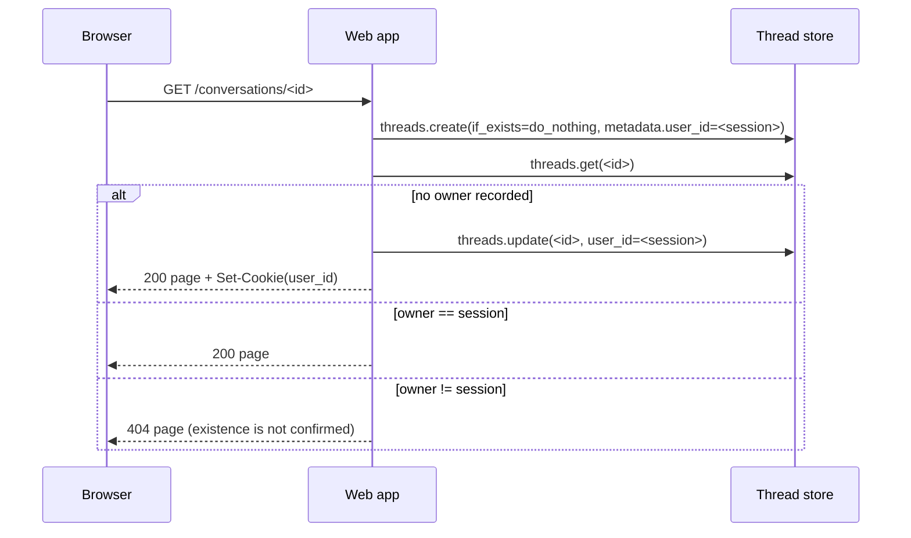

# Security & deployment

Phase 10A hardened the demo for a *single* public instance and prepared the
container artifacts. It did **not** deploy anything: nothing in this document
has been run against a public host, and no cloud resource was created.

Everything below describes what the code actually enforces today, what it does
not, and how to start the production-like stack locally.

## 1. What the process serves

The LangGraph server and the custom web app share one port (`8000` in the
container, `2024` with `langgraph dev`, `8123` through the compose file).

| Path | Handler | Exposed to the browser? | Notes |
|---|---|---|---|
| `/` | web app | yes | redirect to a fresh conversation, sets the session cookie |
| `/new-thread` | web app | yes | same as `/` |
| `/conversations/{thread_id}` | web app | yes | 404 for a thread owned by another session |
| `/conversations/{thread_id}/send-message` | web app | yes | limits: length, rate, concurrency |
| `/conversations/{thread_id}/stream` | web app | yes | SSE; closes immediately without a queued message |
| `/evaluation` | web app | yes | reads `docs/evaluation_summary.json`; no model call |
| `/health` | web app | yes | four safe fields; safe to expose to a load balancer |
| `/static/{filename}` | web app | yes | allowlist of exactly two vendored files |
| `/threads*`, `/runs*`, `/assistants*`, `/store*`, `/mcp*` | runtime | **only with a token** | full read/write API over every conversation |
| `/docs`, `/redoc`, `/openapi.json` | runtime | **only with a token** | schema disclosure |

The raw runtime API is the important line item: without a token, anybody who
can reach the port can list threads, read their state and start runs. That is
why `LANGGRAPH_DEMO_API_TOKEN` exists. The runtime documents **67 paths** in
`/openapi.json`; the browser surface above is the only part a public reverse
proxy may forward (see `deploy/Caddyfile.example`).

### Authentication modes

| `LANGGRAPH_DEMO_API_TOKEN` | Behaviour |
|---|---|
| unset or blank | local demo: every request is accepted as `default_user`. Only safe on `localhost`. |
| set | every request needs `Authorization: Bearer <token>`; the web app forwards the token on its own in-process calls, so the browser never sees it. Requests without it get `401` and the token never appears in a log line. |

This is a **shared secret, not an account system**. There is no per-user login,
no password reset, no session revocation, and one token grants access to the
whole API. A future phase must decide between a proxy that terminates real user
auth, or `auth.on.threads.*` handlers plus per-user metadata filtering.

### Conversation ownership

The web app tags every conversation it creates with `user_id`, an opaque uuid
stored in an `HttpOnly; SameSite=lax` cookie that the server also compares on
`/conversations/*`:



Consequences worth knowing:

* A conversation created through the API (Studio, `curl`) has no owner. The
  first browser that opens it claims it; afterwards only that browser can use
  it.
* Clearing cookies loses access to your own conversations. They are not
  deleted, but the web app will answer 404.
* This is a **barrier, not encryption**: `GET /threads` with the API token still
  returns every thread. Do not store anything in a conversation that must stay
  private from the operator of the instance.

The cookie is always `HttpOnly; SameSite=lax`. `Secure` is added automatically
when the request arrived over HTTPS (directly or via the proxy's
`X-Forwarded-Proto` header); `WEB_COOKIE_SECURE=true|false` overrides that
detection. Leaving it on `auto` (the default) keeps plain-HTTP local
development working while the public deployment gets HTTPS-only cookies.

## 2. Server-side limits (no browser required)

Configured in `.env`, read when the process starts:

| Variable | Default | Enforcement |
|---|---|---|
| `WEB_MAX_INPUT_CHARS` | 4000 | `413` with a Chinese notice, before a run is queued |
| `WEB_RATE_LIMIT_PER_MINUTE` | 6 | `429`, rolling window, per session cookie |
| `WEB_RATE_LIMIT_PER_HOUR` | 40 | `429`, rolling window, per session cookie |
| `WEB_MAX_ACTIVE_RUNS_PER_SESSION` | 1 | `429` while a run of that session is queued or streaming |
| `LOG_LEVEL` | `INFO` | log verbosity of the `react_agent` logger |

The browser is not asked to enforce any of this: the checks run in the route
handler before `runs.create` is called. Clearing cookies resets the session
identity and therefore the rate-limit bucket - the documented bypass of a
cookie-based bucket. It is acceptable for a portfolio demo with a published
cost ceiling; `deploy/Caddyfile.example` explains why a proxy-level limit is
not added (Caddy's standard build has none, and unverified modules are out of
scope) and what the alternatives are.

## 3. Secrets

| Secret | Where it goes | Never |
|---|---|---|
| `DEEPSEEK_API_KEY` | `.env` → container env | never in the image, never in a log line, never in a response |
| `LANGGRAPH_DEMO_API_TOKEN` | `.env` → container env | never echoed; rejected tokens are not logged either |
| `LANGSMITH_API_KEY` (optional) | `.env` → container env | traces contain user messages; leave tracing off if you do not want that |

`/health` returns `status`, `graph_loaded`, `vectorstore_available` and
`embedding_loaded` only - no paths, no keys, no URIs. Tests assert that.

`.gitignore` and `.dockerignore` both exclude `.env*` (except `.env.example`),
`data/evals/`, logs and the local indexes, so a `docker build .` cannot bake a
credential or a gigabyte of vectors into a layer.

## 4. Container artifacts

`scripts/prepare_docker.py` generates everything and works without Docker:

```bash
uv run python scripts/prepare_docker.py          # write artifacts
uv run python scripts/prepare_docker.py --check  # verify they are current
```

It calls the official `langgraph dockerfile` generator and then applies three
patches, each of which is documented in the generated file:

| Patch | Why |
|---|---|
| forward slashes in `ENV LANGGRAPH_AUTH` | the CLI writes `src\\react_agent\\auth.py` on Windows; a Linux container cannot import that, so auth would silently disappear |
| `docker/requirements.lock.txt` instead of `uv pip install -e .` | the image installs the versions the project was tested with, exported from `uv.lock` (CUDA-only packages removed) |
| CPU-only `torch` from `download.pytorch.org/whl/cpu` | PyPI's Linux wheel drags in ~4 GB of CUDA runtime that a CPU deployment never uses |

`docker/docker-compose.yml` is built from the LangGraph CLI's own
`compose_as_dict()`, so Redis, Postgres (`pgvector/pgvector:pg16`) and the API
healthcheck match what `langgraph up` produces. The changes are:

* the API port is published on **`127.0.0.1:8123` only** - the reverse proxy is
  the single process that faces the internet;
* **Postgres is not published to the host at all**: 5432 and 6379 live on the
  compose network, so there is nothing for a firewall rule to save you from.
  `deploy/docker-compose.debug.yml` adds a loopback-only 5433 mapping when you
  need `psql` from the host, and that file must never be used on a server;
* `../.env` as the API environment file (secrets stay out of the compose file);
* a named volume `psychegraph-hf` on `/cache/huggingface` (BGE-M3 ~2.2 GB);
* a bind mount `../data/vectorstore` on `/data/vectorstore` (the index);
* `restart: unless-stopped` on the API service.

Requires Docker ≥ 25 / Compose ≥ v2.24 (`healthcheck.start_interval`, optional
`env_file`). Host port and bind address are arguments:
`uv run python scripts/prepare_docker.py --port 8180 --bind 127.0.0.1`.

The full public-deployment sequence - server prerequisites, Docker install,
secrets, build, compose, prewarm, Caddy/HTTPS, firewall, smoke, backup,
upgrade, rollback, troubleshooting - is `docs/PRODUCTION_DEPLOYMENT.md`.
Backups of the two stateful pieces are scripted in `scripts/backup_demo.sh`
(Postgres dump + vector store archive; it never touches `.env`).

## 5. Production-like local runbook

Run this on a machine with Docker; it is the exact sequence Phase 10A could not
finish on the development host (no Docker, no WSL2).

```bash
# 0. one-time: artifacts + secrets
uv run python scripts/prepare_docker.py
cp .env.example .env      # PowerShell: Copy-Item .env.example .env
#    set DEEPSEEK_API_KEY, and LANGGRAPH_DEMO_API_TOKEN for a shared instance

# 1. build (linux/amd64 image, ~2-3 GB because of torch + transformers)
docker build -f docker/Dockerfile -t psychegraph:local .

# 2. start API + Postgres + Redis
docker compose -f docker/docker-compose.yml --env-file .env up -d

# 3. wait for the healthcheck
docker compose -f docker/docker-compose.yml ps

# 4. smoke test
curl http://localhost:8123/health
#   {"status":"degraded","graph_loaded":true,"vectorstore_available":false,...}
#   "degraded" is expected until the index is mounted; see below.

# 5. first user request (loads BGE-M3 inside the container)
curl -s -X POST http://localhost:8123/threads \
     -H "Authorization: Bearer $LANGGRAPH_DEMO_API_TOKEN" \
     -H "Content-Type: application/json" -d '{}'

# 6. logs and shutdown
docker compose -f docker/docker-compose.yml logs -f langgraph-api
docker compose -f docker/docker-compose.yml down
```

The vector store is a deploy-time artifact, not part of the image: index the
knowledge base on the host (`uv run python scripts/index_knowledge.py
--rebuild`), make sure the folder is on `/data/vectorstore` via the bind mount,
and only then start user traffic. The Hugging Face weights download once into
`psychegraph-hf`; `scripts/prewarm_rag.py` is the supported way to pay that
cost before a user does.

Step 4 is scripted, and the script is also the container smoke test used on the
VPS (`docs/PRODUCTION_DEPLOYMENT.md`, step 11). Run it from the host - or, if
you run it inside a container, call `python scripts/smoke_local.py`, never
`uv run`, because the image installs its dependencies into the system
interpreter:

```bash
uv run python scripts/smoke_local.py --url http://127.0.0.1:8123 \
    --token "$LANGGRAPH_DEMO_API_TOKEN"
```

Because this development host has no Docker, the container steps themselves
remain **unverified**: the image builds, the container starts, `/health` answers
inside the container, Postgres/Redis become healthy, a real run reaches
DeepSeek, and RSS inside the container. `docs/PRODUCTION_DEPLOYMENT.md` lists
the exact commands and marks each one verified or not.

## 6. Operating it

* **One replica only.** The conversation registry, the run queue and the rate
  limiter live in the process. A second replica would let a session run two
  answers at once and would double the limits. `WEB_REPLICAS=1` documents this;
  the container size in `docs/DEPLOYMENT_BENCHMARK.md` assumes it.
* **TLS and edge protection belong in front of the container.** Terminate HTTPS
  in a reverse proxy (Caddy, nginx, Traefik), forward `/` unchanged, and keep
  the runtime API paths behind the same token. If a CDN is used, the SSE headers
  (`X-Accel-Buffering: no`) are already set, but the proxy must not buffer
  `text/event-stream`.
* **Logs** go to stdout (`LOG_LEVEL` controls verbosity). They contain short
  thread ids, durations and counts - never message text, tokens or paths.
* **Backups** that matter: the Postgres volume (`langgraph-data`) and the vector
  store directory. The Hugging Face volume is cache, not state.
* **Model cost** is the thing to watch: one answer costs 6-8 DeepSeek calls, so
  the rate limits exist for cost control as much as for fairness.

## 7. Known gaps (deliberately left open)

1. Deploying anywhere: this phase stops at "runs locally in a container".
2. Real user accounts, per-user quotas, account-based rate limiting.
3. Turning the session cookie into something a determined user cannot reset.
4. An async retrieval driver (the node now uses `asyncio.to_thread`, which is
   enough for one user but is not a concurrency strategy).
5. Tuning the limits against real traffic; today's numbers are guesses with a
   tested enforcement path.
