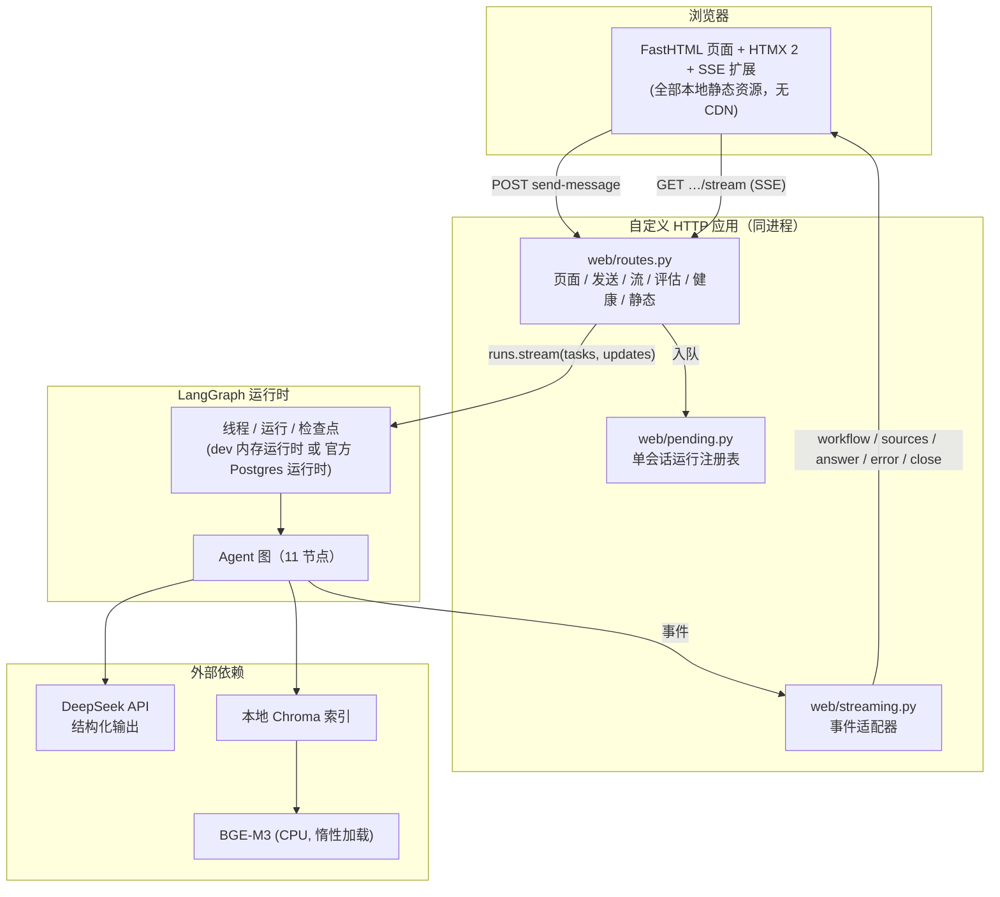
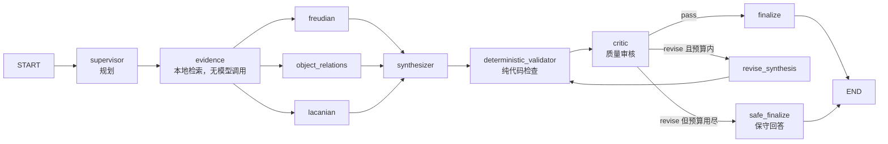

# PsycheGraph 技术说明文档（Technical Overview）

一份文档讲清整个项目：**它解决什么问题、由哪些层组成、数据怎么流动、怎么验证、怎么部署、已知边界在哪。**
面向两类读者：想快速评估工程质量的工程师 / 面试官，以及将来接手代码的人。

- 演示与使用：`docs/使用说明.md`
- 逐层细节文档：`docs/ARCHITECTURE.md`、`MODEL_PROVIDER.md`、`STRUCTURED_OUTPUT.md`、
  `MULTI_AGENT_ARCHITECTURE.md`、`RAG_ARCHITECTURE.md`、`CRITIC_ARCHITECTURE.md`、
  `EVALUATION.md`、`WEB_ARCHITECTURE.md`、`SECURITY_DEPLOYMENT.md`、`PRODUCTION_DEPLOYMENT.md`

---

## 1. 项目定位与边界

**是什么**：一个多智能体（multi-agent）精神分析理论探索与文本解释系统。
输入一段梦境/叙事/文学文本，系统用三个学派的视角（弗洛伊德、客体关系、拉康）分别解读，
综合成一个回答，并经过确定性检查与 LLM 质量审核后发布；回答中的每个理论断言可以引用本地检索到的段落。

**不是什么**（写进 UI、README、评估口径）：

- 不是临床诊断/治疗/医疗建议工具；对诊断类请求一律给简短说明并拒答；
- 不是"原著数据库"：仓库自带语料是**项目自编测试材料**（`tests/fixtures/knowledge`，front matter `test_fixture: true`）；
- 不是账号系统：`LANGGRAPH_DEMO_API_TOKEN` 是内部共享令牌，浏览器会话是演示级隔离。

**工程目标**：可解释（每一步可见）、可核验（引用可追溯）、可兜底（质量不过关时走保守回答）、可部署（容器 + 反代 + 备份）、可回归（378 单测 + 评估工件）。

---

## 2. 总体架构



三条硬约束决定了这套结构：

1. **EventSource 只能发 GET** → 消息先用 POST 入队（`pending.py`），再由 GET 的 SSE 请求创建并流式返回同一个 run，避免"run 先跑完、浏览器再订阅"的竞态。
2. **结构化输出没有增量 token** → 最终答案只在 finalize 之后存在，所以 UI 展示"节点级进度"而不是假的打字效果。
3. **检索是 CPU 重活** → evidence 节点用 `asyncio.to_thread` 把 BGE-M3 与 Chroma 调用移出事件循环（因此不再需要 `--allow-blocking`）。

---

## 3. 技术栈（实际锁定版本）

| 层 | 选择 | 版本 |
|---|---|---|
| 语言 / 运行时 | Python | 3.13.5（本机 venv）|
| 依赖管理 | uv（`uv.lock` 已提交） | uv 0.12.14 |
| 编排 | LangGraph `StateGraph` + LangGraph API 服务器 | langgraph 1.2.11 / langgraph-api 0.14.1 |
| 模型 | DeepSeek（`langchain-deepseek`，function-calling 结构化输出） | langchain-deepseek 1.1.0 |
| 校验 | Pydantic v2 | 2.12.5 |
| 检索 | `langchain-chroma` + `sentence-transformers`（BAAI/bge-m3，CPU） | 1.1.0 / 6.0.1 |
| 向量库 | Chroma（本地持久化，sqlite 单目录） | chromadb 1.5.9 |
| 推理 | torch CPU wheel（`+cpu`，镜像内不装 CUDA 包） | torch 2.14.0+cpu |
| Web | FastHTML 服务端渲染 + HTMX + htmx-ext-sse（vendored） | python-fasthtml 0.14.13 / htmx 2.0.7 / sse 2.2.1 |
| 质量工具 | ruff / mypy(--strict) / pytest | 0.16.7 / 2.3.1 / 9.1.1 |

---

## 4. Agent 图（核心）

### 4.1 节点与边



- **模型调用**：正常一轮 **6 次**（supervisor、3 个 specialist、synthesizer、critic）；发生一次修订为 **8 次**。
- `evidence`、`deterministic_validator`、`finalize`、`safe_finalize` **不调用模型**。
- 三个 specialist 是**真并行**（同一超步内 fan-out，再 fan-in 到 synthesizer）；UI 会同时显示三条"进行中"。
- **修订预算**由状态里的 `revision_count` 控制（默认最多 1 次），保证成本与延迟有上界。

### 4.2 状态契约（`state.py`）

| 字段 | 类型 | 归约 | 含义 |
|---|---|---|---|
| `messages` | `list[BaseMessage]` | `add_messages` | 对话历史（用户消息 + 最终回答） |
| `supervisor_plan` | `dict` | 覆盖 | 规划结果：问题类型、要检索什么、注意事项 |
| `evidence_by_school` | `dict[str, list[dict]]` | 覆盖 | 按学派分组的检索段落（含 `evidence_id`、元数据、分数） |
| `evidence_meta` | `dict` | 覆盖 | 检索统计（是否可用、耗时、各学派计数、失败原因） |
| `specialist_results` | `dict[str, dict]` | `operator.ior` | 三个 specialist 的独立输出（并行写入靠这个归约） |
| `draft_result` | `dict` | 覆盖 | 综合草稿（内部使用，不直接进 UI） |
| `deterministic_issues` | `list[dict]` | 覆盖 | 代码检查发现的问题（引用越界、字段缺失等） |
| `critique` | `dict` | 覆盖 | 审核结论：pass / revise、问题清单、是否仍需修订 |
| `revision_count` | `int` | 覆盖 | 已发生修订次数（预算控制） |
| `final_result` | `dict` | 覆盖 | 最终对外的回答对象（回答文本、理论标签、`used_evidence_ids`、质量行） |
| `finalization_status` | `str` | 覆盖 | `passed` / `revised_and_passed` / `safe_fallback`（UI 的质量行由它派生） |

### 4.3 结构化输出（`schemas.py` + `prompts.py`）

每个模型节点都要求返回 Pydantic 模型（function calling），失败时按固定次数重试并降级。
契约都在 `schemas.py`：

- `SupervisorPlan`：问题类型、检索查询、学派侧重、风险提示；
- `SchoolAnalysis` + `TheoryInterpretation`：单学派输出（perspective / observations /
  interpretations，每条断言带 `textual_basis`、`uncertainty`、`evidence_ids` / limitations / questions / summary）；
- `SynthesisResult`：综合回答、每条理论点的出处、`used_evidence_ids`；
- `CritiqueResult` + `CriticIssue`：审核结论（pass / revise）、问题清单、是否必须再修订；
- `DeterministicIssue`：代码检查发现的问题（引用越界、字段缺失等）；
- `EvidenceItem`：检索段落的统一表示（id / 学派 / 文本 / 元数据 / 分数）。

模型层（`llm.py`）统一处理 provider 选择、超时、重试与错误分类；**错误信息永不外泄到浏览器**。
修订预算是一个显式常量：`config.py` 里的 `MAX_REVISION = 1`。

---

## 5. 质量层（为什么不直接发布 synthesizer 的输出）

1. **`deterministic_validator`（纯代码）**：检查引用 id 是否都在本轮证据里、必填字段是否齐全、文本是否为空、是否存在明显越界断言。这是最便宜、最可靠的一道闸。
2. **`critic`（LLM）**：判断"是否回答了问题、是否理论区分、是否过度断言、是否需要修订"，输出结构化 `Critique`。
3. **修订路径**：`revise_synthesis` 只改综合草稿（不重跑 specialist），修订后再过一次确定性检查（成本可控）。
4. **兜底路径**：预算用尽仍未通过 → `safe_finalize` 用受限模板产出**保守回答**，UI 上标记为保守发布，且不带未经核验的引用。

**证据降级**：索引不存在/不可用时，`evidence` 节点返回 `available=False`，下游提示词明确写"没有本地文献依据"，
回答照常产出但**不生成引用**——系统宁可少说，也不编造出处。

---

## 6. RAG 层（本地、可复现、无云 embedding）

| 模块 | 职责 |
|---|---|
| `rag/settings.py` | 环境变量读取（模型名、设备、路径、collection、top-k、chunk 大小、启用开关） |
| `rag/ingestion.py` | 读取 `knowledge/<school>/*.md`，按 front matter 分类，切块（默认 1000/150） |
| `rag/embeddings.py` | BGE-M3 惰性加载（`lru_cache` 单例），加载失败抛 `EmbeddingUnavailableError` |
| `rag/vectorstore.py` | Chroma 持久化目录、`index_exists()`、`open_vectorstore()`、`collection_count()` |
| `rag/retriever.py` | 按学派过滤检索、返回 `RetrievalOutcome`（段落 + 统计 + 失败原因） |
| `rag/citations.py` | 把段落映射成可展示的 `CitationRef`（**剥掉服务器路径**） |

- **部署形态**：索引是**离线工件**（`scripts/index_knowledge.py --rebuild`），启动时只读挂载，绝不在请求路径上建索引。
- **模型加载**：首次检索触发加载；实测 12–25 s（本机）/ 容器内首次含下载约 850 s、重启后热加载 24.8 s。
- **资源**：应用容器峰值 **1.70 GiB**（含页面缓存），当前 ~885 MiB；索引本身很小（演示语料 16 chunks）。

---

## 7. Web 层（FastHTML + HTMX + SSE）

### 7.1 路由

| 路径 | 说明 |
|---|---|
| `/`、`/new-thread` | 生成新会话 id，重定向到会话页，下发会话 cookie |
| `/conversations/{thread_id}` | 三栏会话页（越权 → 404，不确认存在性） |
| `/conversations/{thread_id}/send-message` | 入队 + 返回用户气泡 / 占位 / OOB 片段；超限 → 413/429 |
| `/conversations/{thread_id}/stream` | SSE 流：创建并流式返回该会话的本次 run |
| `/evaluation` | 渲染 Phase 8 评估工件（不调用模型） |
| `/health` | 4 个安全字段（见 §8） |
| `/static/{filename}` | **白名单**只服务两个 vendored 文件 |

### 7.2 SSE 事件契约（5 个事件）

| 事件 | 内容 | UI 动作 |
|---|---|---|
| `workflow` | 节点开始/结束、状态、真实耗时 | 右栏流程面板逐节点更新 |
| `sources` | 本轮证据卡片（学派 + 元数据 + 摘要） | 右栏证据面板分组渲染 |
| `answer` | 最终回答片段（只在 finalize/safe_finalize 之后） | 替换"分析中"占位气泡 |
| `error` | 一句安全中文提示 | 显示提示并恢复输入框 |
| `close` | 结束标记 | 关闭 EventSource、恢复输入框 |

**净化规则**（有测试覆盖）：草稿、审核意见、规划、专家中间结果、原始 tool-call 参数、服务器路径一律**不进事件流**；
用户文本作为 FT 文本节点输出（自动转义）；引用标签只暴露 `used_evidence_ids`。

---

## 8. 运维与安全（Phase 10A 加固）

| 机制 | 实现 | 默认值 |
|---|---|---|
| 输入上限 | `web/limits.py`，按 Unicode 字符计数 | 4000 字符 → `413` |
| 速率限制 | 会话维度滑动窗口（分钟 + 小时） | 6/分钟、40/小时 → `429` |
| 并发上限 | 每会话同时 1 条运行 | `429`，队列不被覆盖 |
| 会话归属 | `web/access.py` + 线程 metadata `user_id`（HttpOnly/SameSite=Lax cookie） | 越权 → 404 |
| 共享令牌 | `auth.py`：`LANGGRAPH_DEMO_API_TOKEN`，常数时间比较；Web 内部调用自动转发 | 未设置=本地模式 |
| 健康检查 | `web/health.py` | `status/graph_loaded/vectorstore_available/embedding_loaded` |
| 静态资源 | htmx 与 SSE 扩展 vendored 到 `src/react_agent/static/` | 无 CDN 依赖 |
| 日志 | `logging_config.py`（`LOG_LEVEL`） | 短线程 id + 耗时 + 计数，无密钥/无原文 |
| Cookie 安全 | HTTPS 下自动加 `Secure`（`WEB_COOKIE_SECURE=auto`） | 本地 HTTP 不加，避免功能失效 |

**实测**：无令牌 `401`；跨会话 `404`；413/429 生效；失败路径事件为 `workflow,error,close` 且 **0 个 answer 帧**、无 traceback/密钥。

---

## 9. 部署（三套工件，各自的边界）

| 工件 | 文件 | 用途 | 状态 |
|---|---|---|---|
| 官方生产镜像 | `docker/Dockerfile`（由 `scripts/prepare_docker.py` 生成 + 三处补丁：正斜杠 auth 路径、锁文件安装、CPU torch）+ `docker/docker-compose.yml`（API 仅绑 `127.0.0.1`、Postgres/Redis 不发布端口） | 真实生产 | 镜像**构建成功（2.92 GB / 5.4 min）**；**启动被许可阻断** |
| 开发运行时镜像 | `docker/Dockerfile.dev` + `deploy/docker-compose.dev.yml` | 演示/排练 | 镜像 2.36 GB；`/health` ok；13/13 冒烟通过；**状态在内存** |
| 反代与运维 | `deploy/Caddyfile.example`（域名+自动 HTTPS）、`deploy/Caddyfile.localhost.example`（本地演练）、`scripts/backup_demo.sh`、`docs/PRODUCTION_DEPLOYMENT.md` | 公网入口/备份/手册 | Caddy 配置已 `validate` 并本地实测（白名单 404、安全头、SSE 不缓冲、Secure cookie） |

**为什么官方镜像起不来**：它以 `LANGSMITH_LANGGRAPH_API_VARIANT=licensed` + `LANGGRAPH_RUNTIME_EDITION=postgres`
运行，启动时做许可校验（`License verification failed`），镜像内没有可替代的内存运行时。
满足条件：`LANGGRAPH_CLOUD_LICENSE_KEY`（生产许可）或带 LangGraph Cloud 访问权的 `LANGSMITH_API_KEY`。

**冒烟工具**：`scripts/smoke_local.py`（13 项，含真实回答；`--behind-proxy` 断言 `/threads` 被代理 404；`--insecure` 支持自签）。
**资源基准**：`scripts/bench_rss.py`（RSS/耗时阶梯）；容器实测峰值 1.70 GiB → **4 GB 起步、8 GB 舒适**，瓶颈是 CPU 不是内存。

---

## 10. 评估体系（Phase 8 工件，60 用例 × 4 变体）

| 变体 | LLM 调用 | 时延 | token | 理论区分度 | 引用有效率 | 临床边界 |
|---|---|---|---|---|---|---|
| Single Agent | 1.00 | 12.3 s | 3,244 | 3.92 | N/A | 5.00 |
| Multi Agent | 5.03 | 57.5 s | 19,753 | 4.27 | N/A | 5.00 |
| Multi Agent + RAG | 5.10 | 57.5 s | 23,138 | 4.45 | 1.00 | 4.92 |
| Full System（Critic） | 6.23 | 67.0 s | 33,692 | 4.42 | 1.00 | 4.92 |

- 指标定义与全部表格：`docs/EVALUATION.md`；页面 `/evaluation` 只读 `docs/evaluation_summary.json`（60 用例、240 次运行、0 失败）。
- 度量的是**工程行为**（可核验、可区分、守边界、成本、时延），**不是**精神分析理论或疗效的正确性。

---

## 11. 测试与质量门

| 项目 | 命令 | 当前结果 |
|---|---|---|
| 单元/集成测试 | `uv run python -m pytest tests/unit_tests -q` | **378 passed**（含 Web/SSE 集成、归属、限流、认证、日志、异步证据） |
| Lint | `uv run ruff check src scripts tests` | 通过 |
| 格式 | `uv run ruff format --check src scripts tests` | 100 文件通过 |
| 类型 | `uv run mypy src/react_agent --strict` | 57 文件 0 错误 |
| 编译 | `uv run python -m compileall src scripts` | 通过 |
| 容器产物一致性 | `uv run python scripts/prepare_docker.py --check` | Dockerfile / compose / 依赖锁一致 |
| 端到端冒烟 | `uv run python scripts/smoke_local.py …` | 13/13（含真实回答） |

测试原则：**不调用真实模型、不访问网络**；`RAG_ENABLED=false` 作为 autouse 默认，防止单测加载 2 GB 模型；
Web 测试用回放的 SSE 事件（`tests/unit_tests/web_helpers.py`，事件形状取自真实服务器录制）。

---

## 12. 目录结构（关键部分）

```
src/react_agent/
  graph.py            # 图装配（11 节点、条件边）
  state.py            # 状态契约与归约
  schemas.py          # Pydantic 结构化输出契约
  prompts.py          # 各节点提示词
  llm.py              # 模型客户端（DeepSeek、重试、错误分类）
  models.py / config.py / validation.py
  agents/             # supervisor / evidence / 三个 specialist / synthesizer / validator / critic / revision / finalizer
  rag/                # settings / ingestion / embeddings / vectorstore / retriever / citations
  web/                # app, routes, streaming, events, workflow, render, components, fragments,
                      # citations, pending, limits, access, health, evaluation, nodes, assets
  evaluation/         # dataset / variants / runner / judge / metrics / aggregate / experiment / usage
  auth.py             # 共享令牌认证
  logging_config.py   # 日志级别与降噪
  app.py              # langgraph.json 指向的薄壳（re-export web.app）
scripts/              # index_knowledge / prewarm_rag / bench_rss / smoke_local /
                      # prepare_docker / fetch_static_assets / backup_demo / 评估与验证脚本
docker/               # Dockerfile（官方生成+补丁）、Dockerfile.dev、docker-compose.yml、requirements.lock.txt
deploy/               # Caddyfile.example、Caddyfile.localhost.example、docker-compose.dev.yml、debug override
docs/                 # 本文件与各层架构文档、部署/安全/基准文档
tests/unit_tests/     # 378 个测试 + 回放夹具；tests/fixtures/knowledge/ 为自编测试语料
```

---

## 13. 已知限制与技术债（诚实清单）

1. **官方运行时需要许可**：没有 LangSmith Key / 平台许可时，只能跑开发运行时（内存态，重启丢会话）。
2. **容器内会话不持久**（路径 A）：Postgres/Redis 未被使用；这是运行时选择的结果，不是配置遗漏。
3. **单一共享令牌**：不是账号系统，无按用户配额；限流按 cookie，清 cookie 可绕过（已在安全文档记录）。
4. **索引为测试语料**：`knowledge/` 里没有真实原著语料；引用可信度演示的是"机制"，不是"文献权威性"。
5. **流程面板不回溯**：刷新后能看到会话与最新回答（含引用），但运行中的步骤日志不重建。
6. **无取消按钮**；一轮分析 40–80 s，期间只能等。
7. **修订上限 1 次**：这是成本/质量权衡，可在状态与提示词层调整。
8. **未验证项**：公网 HTTPS/DNS/防火墙、官方运行时在容器内的端到端行为（被许可阻断）。
9. **Windows + Docker Desktop 的坑**：hosts 拦截 Docker 域名、WSL2 不能访问宿主 loopback 代理、
   bind mount 会阻止目录改名——都已写进 `docs/PRODUCTION_DEPLOYMENT.md` 的排障章节。

---

## 14. 阶段里程碑（Phase 0 → 10B）

| 阶段 | 交付 |
|---|---|
| 0–1 | 工程骨架、单代理基线、模型提供层 |
| 2–3 | 结构化输出契约、状态与校验 |
| 4 | 多代理（supervisor + 三学派 specialist + synthesizer） |
| 5 | 本地 RAG（BGE-M3 + Chroma、引用映射、诚实降级） |
| 6–7 | Critic 与有界修订、确定性检查与兜底发布 |
| 8 | 评估框架（60×4 变体、指标、聚合工件、`/evaluation` 页面） |
| 9 | FastHTML + HTMX + SSE Web UI、事件契约、真实浏览器验证 |
| 10A | 生产加固：异步证据节点、/health、限额、归属、令牌、静态自托管、Docker 产物、备份与文档 |
| 10B | 容器化验证：镜像构建、三容器形态、容器内 prewarm/冒烟/基准/降级/失败路径；官方运行时受许可阻断（改用开发运行时演示） |
